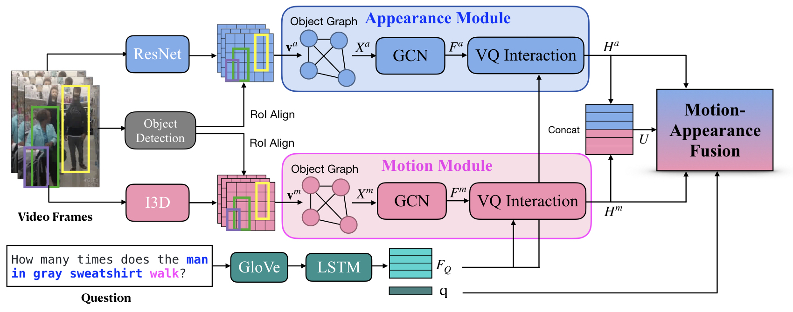

Motion-Appearance Synergistic Networks for VideoQA (MASN)
========================================================================

Pytorch Implementation for the paper:

**[Attend What You Need: Motion-Appearance Synergistic Networks for Video Question Answering][1]** <br>
Ahjeong Seo, [Gi-Cheon Kang](https://gicheonkang.com), Joonhan Park, and [Byoung-Tak Zhang](https://bi.snu.ac.kr/~btzhang/) <br>
In ACL 2021

<!---->


Requirements
--------
python 3.7, pytorch 1.2.0


Dataset
--------
- Download [TGIF-QA](https://github.com/YunseokJANG/tgif-qa) dataset and refer to the [paper](https://arxiv.org/abs/1704.04497) for details.
- Download [MSVD-QA and MSRVTT-QA](https://github.com/xudejing/video-question-answering).

Extract Features
--------
1. Appearance Features
- For local features, we used the Faster-RCNN pre-trained with Visual Genome. Please cite this [Link](https://github.com/peteanderson80/bottom-up-attention).
- For global features, we used ResNet152 provided by torchvision. Please cite this [Link](https://github.com/pytorch/vision/blob/master/torchvision/models/resnet.py).

2. Motion Features
- For local features, we use RoIAlign with bounding box features obtained from Faster-RCNN. Please cite this [Link](https://github.com/AceCoooool/RoIAlign-RoIPool-pytorch).
- For global features, we use I3D pre-trained on Kinetics. Please cite this [Link](https://github.com/Tushar-N/pytorch-resnet3d).


Training
--------
Simple run
```sh
CUDA_VISIBLE_DEVICES=0 python main.py --task Count --batch_size 32
```

### Saving model checkpoints  
By default, our model save model checkpoints at every epoch. You can change the path for saving models by `--save_path` options.
Each checkpoint's name is '[TASK]_[PERFORMANCE].pth' in default.


Evaluation & Results
--------
```sh
CUDA_VISIBLE_DEVICES=0 python main.py --test --checkpoint [NAME] --task Count --batch_size 32
```

Performance on TGIF-QA dataset:

  Model  |  Count   |  Action   |  Trans.  | FrameQA  |
 ------- | ------ | ------ | ------ | ------ |
MASN | 3.75 | 84.4 | 87.4 |  59.5|


Citation
--------
If this repository is helpful for your research, we'd really appreciate it if you could cite the following paper:
```text
@article{seo2021attend,
  title={Attend What You Need: Motion-Appearance Synergistic Networks for Video Question Answering},
  author={Seo, Ahjeong and Kang, Gi-Cheon and Park, Joonhan and Zhang, Byoung-Tak},
  journal={arXiv preprint arXiv:2106.10446},
  year={2021}
}
```


License
--------
MIT License

Acknowledgements
--------
 This work was partly supported by the Institute of Information & Communications Technology Planning & Evaluation (2015-0-00310-SW.StarLab/25%, 2017-0-01772-VTT/25%, 2018-0-00622-RMI/25%, 2019-0-01371-BabyMind/25%) grant funded by the Korean government.
 
 
 [1]: https://arxiv.org/abs/2106.10446
